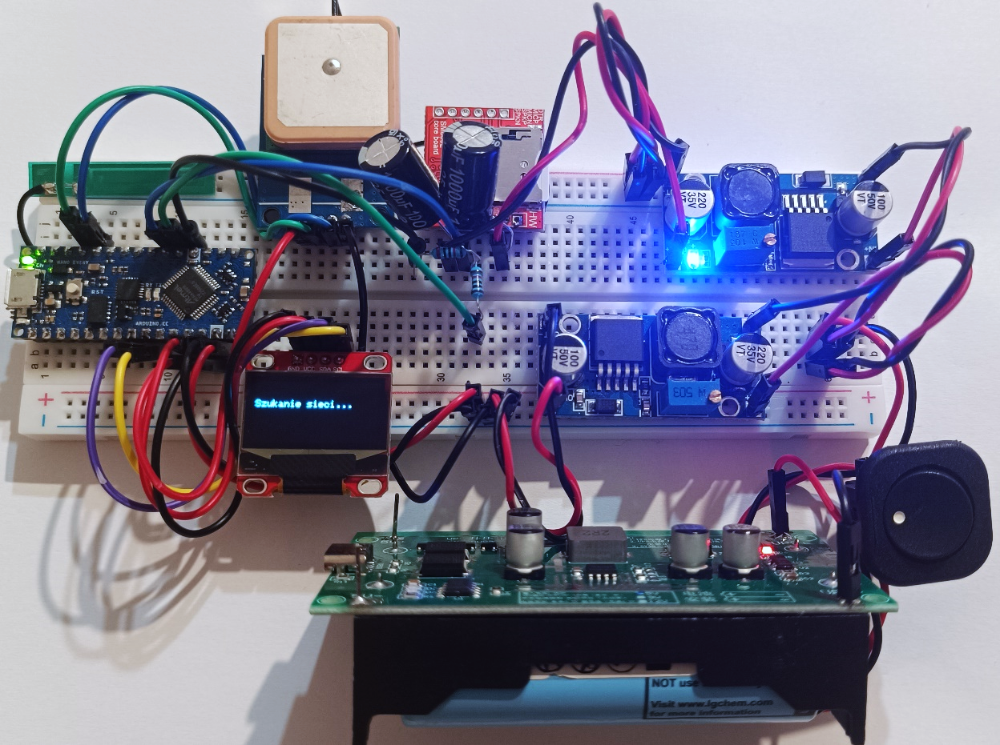
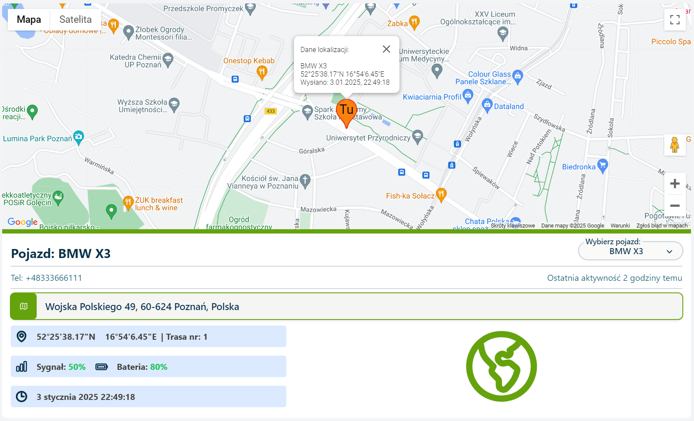
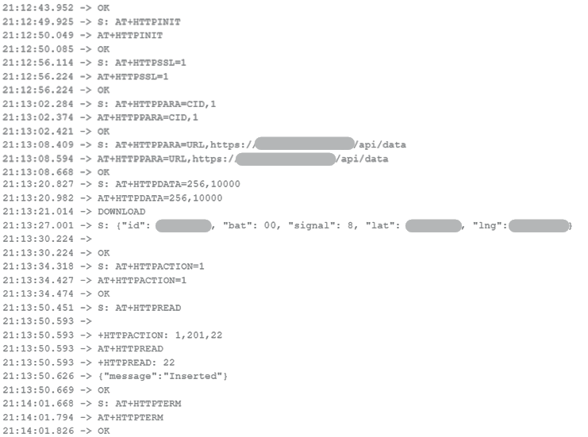
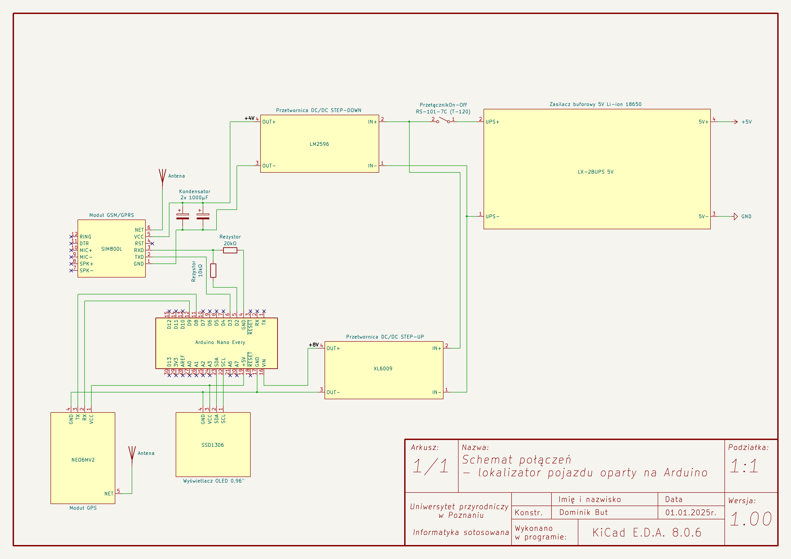
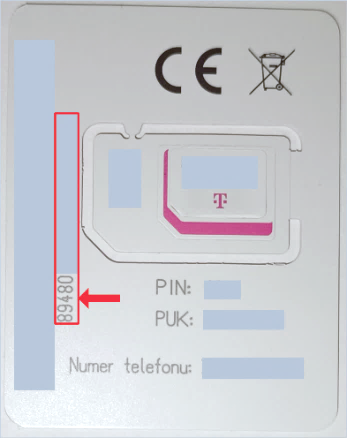
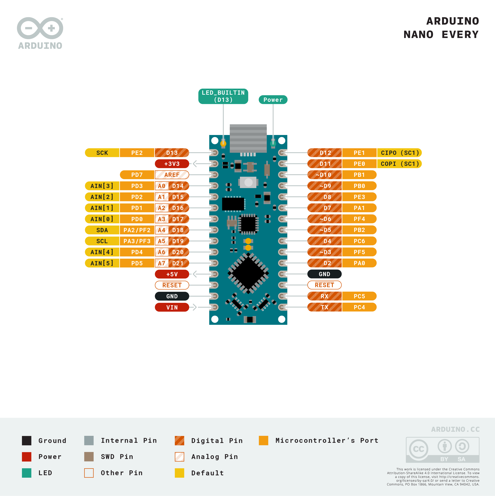

# Lokalizator Arduino Nano Every

<h3 align="center">
Lokalizator pojazdu jest sprzętową częścią autorskiego systemu lokalizacji pojazdów, opracowanego w ramach pracy inżynierskiej.
</h3>

<p align="center">
  <a href="#działanie">Działanie</a> •
  <a href="#konfiguracja">Konfiguracja</a> •
  <a href="#arduino-nano-every">Arduino</a> •
  <a href="#testy">Testy</a> •
  <a href="#licencja">Licencja</a>
</p>


<p align="center">
  
</p>

<p align="center">
Urządzenie zostało zaprojektowane w oparciu o mikrokontroler <b>Arduino Nano Every</b> oraz moduły GPS i GSM. 
</p>
<p align="center">
Jego zadaniem jest cykliczne pozyskiwanie danych geolokalizacyjnych, przygotowanie ich w formacie JSON oraz przesyłanie do aplikacji internetowej poprzez sieć GSM/GPRS.
</p>
<p align="center">
Aplikacja internetowa odbierająca dane lokalizatora została wykonana w technologii Laravel:
<b> <a href="https://github.com/DominikBut/SystemLokalizacji">SystemLokalizacji – aplikacja internetowa</a></b>
</p>


<p align="center">
  
</p>


---
## Działanie

Lokalizator został zaprojektowany do współpracy z aplikacją: [SystemLokalizacji](https://github.com/DominikBut/SystemLokalizacji)

Aplikacja udostępnia interfejs POST API przeznaczony do odbierania danych z lokalizatorów.

Dane przekazywane przez lokalizator mają postać **JSON**.

Przykładowa struktura:

```json
{
    "simID": "123456789",
    "latitude": 52.406374,
    "longitude": 16.925168,
    "strength": 15,
    "battery": 85
}
```
Lokalizator realizuje następujący proces:

```text
┌─────────────────────────┐
│     Arduino Nano Every  │
└────────────┬────────────┘
             │
       ┌─────┴─────┐
       │           │
       ▼           ▼
   NEO6MV2      SIM800L
     GPS        GSM/GPRS
       │           │
       │           │
       ▼           ▼
  współrzędne   połączenie
   geograficzne   z siecią 2G
       │           │
       └─────┬─────┘
             │
             ▼
        JSON + HTTP POST
             │
             ▼
┌─────────────────────────┐
│   SystemLokalizacji     │
│    Laravel POST API     │
└─────────────────────────┘
```

Po uzyskaniu poprawnych współrzędnych Arduino przygotowuje dane w formacie JSON. Następnie przy wykorzystaniu modułu SIM800L nawiązywane jest połączenie z Internetem poprzez GPRS i wykonywane jest żądanie HTTP POST do API aplikacji.

Dane te są odbierane przez API aplikacji i zapisywane jako dane historyczne pojazdu.

Lokalizator oczekuje na odpowiedź serwera, a informacje dotyczące komunikacji są prezentowane na wyświetlaczu OLED oraz w monitorze portu szeregowego.

**Przykładowy zapis komunikacji lokalizatora podczas przesyłania danych.**

<p align="center">
  
</p>

---
## Konfiguracja

### Komponenty

Do budowy projektu wymagane są następujące elementy sprzętowe lokalizatora:

| Element            | Zastosowanie                           |
| ------------------ | -------------------------------------- |
| Arduino Nano Every | główny mikrokontroler          |
| NEO6MV2            | pozyskiwanie współrzędnych GPS                          |
| SIM800L            | komunikacja GSM/GPRS i przesyłanie danych                  |
| wyświetlacz OLED 0,96" SSD1306              | prezentacja informacji diagnostycznych |
| LX-2BUPS           | zasilanie i ładowanie akumulatorów     |
| Ogniwa Li-Ion typu 18650       | autonomiczne zasilanie                 |
| Karta SIM z opłaconym dostępem do Internetu | Komunikacja sieciowa|
| 2x Kondensatory np. 1000 µF | Stabilność zasilania |
| Przetwornica step-down np. LM2596 | Zasilanie |
| Przetwornica step-up np. step-up XL6009 | Zasilanie |
| 1x rezystor 10 kΩ | Zasilanie |
| 1x rezystor 20 kΩ | Zasilanie |
| 1x przełącznik On-Off | Zasilanie |
| Przewody | Połączenia elementów |


### Schemat połączeń

Należy odpowiednio połączyć wszystkie elementy lokalizatora.

<p align="center">
  
</p>

Schemat przedstawia sposób połączenia Arduino Nano Every z modułem GPS, modułem GSM, wyświetlaczem OLED oraz pozostałymi elementami układu.

W projekcie wykorzystano komunikację szeregową pomiędzy mikrokontrolerem a modułami GPS i GSM oraz komunikację I²C dla wyświetlacza OLED.

Moduł NEO6MV2 przekazuje dane GPS poprzez UART w formacie NMEA, które następnie są przetwarzane przy pomocy biblioteki **TinyGPSPlus**.

SIM800L zapewnia komunikację GSM/GPRS i umożliwia przesyłanie danych do aplikacji internetowej poprzez HTTP.

---

### Firmware

Program lokalizatora został przygotowany dla platformy Arduino Nano Every.

Kod źródłowy znajduje się [tutaj](https://github.com/DominikBut/Lokalizator-ArduinoNanoEvery/tree/2641eab9b97b47887f9c46fd5bb2cc69555cc723/src/firmware/Lokalizator-pojazdu)

**1. Kod należy otworzyć w Arduino IDE i wybrać płytkę Arduino Nano Every.**

**2. Przed wgraniem programu należy odpowiednio uzupełnić zmienne środowiskowe w kodzie źródłowym:**

* `apn` -  uzpełniany danymi logowania do sieci internet operatora karty sim (domyślnie "internet"),

* `url` - uzupełniamy pełnym adresem URL do POST API odpowiedzialnego za odbiór danych od lokalizatora,

* `SIMID` - uzupełniamy 9 pierwszymi cyframi numeru id karty SIM

**Potencjalne umiejscowienie numeru id karty SIM**

<p align="left">

</p>

**3. Po zakończeniu edycji kodu podłączamy płytkę Arduino i wgrywamy program.**

#### Główne zadania programu:

* inicjalizacja modułów lokalizatora,
* komunikacja z modułem GPS,
* odczyt współrzędnych geograficznych,
* komunikacja z modułem GSM,
* nawiązywanie połączenia GPRS,
* przygotowywanie danych w formacie JSON,
* wysyłanie danych za pomocą HTTP POST,
* odbieranie odpowiedzi serwera,
* prezentowanie informacji diagnostycznych na wyświetlaczu OLED,
* obsługa komunikacji z aplikacją internetową.
  
---

#### Zastosowane biblioteki i technologie


| Biblioteka/technologia | Cel  |
| ------------------- | ------- |
| Arduino SoftwareSerial                 | Wykorzystywana do komunikacji szeregowej z modułami GPS i GSM  |
| TinyGPSPlus             | Służąca do przetwarzania danych otrzymywanych z odbiornika GPS   |
| Adafruit SSD1306   | Wykorzystywana do obsługi wyświetlacza OLED opartego na kontrolerze SSD1306    |
| Adafruit GFX   | Zapewniająca podstawowe funkcje graficzne wykorzystywane przez wyświetlacz OLED    |
| I²C     | Interfejs komunikacyjny wykorzystywany do komunikacji Arduino z wyświetlaczem OLED.    |
| UART    | Komunikacja szeregowa wykorzystywana do wymiany danych pomiędzy Arduino a modułami GPS i GSM.   |
| AT Commands     | Moduł SIM800L jest sterowany przy pomocy komend AT.     |

---
## Arduino Nano Every
**Arduino Nano Every - pinout**
<p align="center">
  
</p>

---

## Testy

Lokalizator został przetestowany w rzeczywistych warunkach podczas przejazdu pojazdem wyposażonym w urządzenie.

W testach lokalizator przesyłał dane średnio co około 3 minuty. Zaobserwowano również, że pierwsze uzyskanie pozycji GPS może trwać nawet około 10 minut w zamkniętych lub silnie zadaszonych pomieszczeniach.

W trakcie testów stwierdzono również chwilowe problemy z połączeniem GSM oraz ograniczony zasięg zastosowanej anteny.

Dokładność lokalizatora została oszacowana na około 2,5 m.


### Ograniczenia

Zastosowany lokalizator posiada ograniczenia wynikające przede wszystkim z wykorzystanych modułów.

Moduł **NEO6MV2** może charakteryzować się ograniczoną dokładnością, szczególnie w gęstej zabudowie miejskiej oraz przy niekorzystnych warunkach.

Moduł **SIM800L** wykorzystuje sieć 2G, która jest technologią starszej generacji. W przyszłości może być konieczne zastąpienie go modułem obsługującym nowsze standardy komunikacji, np. 4G lub inne technologie IoT.

---

## Licencja

Kod źródłowy projektu jest udostępniany na licencji **MIT**.

Wymagane jest zachowanie informacji o prawach autorskich oraz treści licencji.

**Copyright © 2025 Dominik But**

Licencja projektu nie obejmuje automatycznie zewnętrznych bibliotek, dokumentacji ani innych materiałów należących do osób trzecich. Ich wykorzystanie podlega odpowiednim, odrębnym warunkom licencyjnym.

Projekt został zrealizowany z wykorzystaniem otwartego ekosystemu Arduino oraz bibliotek i narzędzi Open Source.

Szczególne znaczenie dla projektu miały:

* Arduino i biblioteki powiązane,
* biblioteka TinyGPSPlus,
* biblioteki Adafruit.

---

<p align="center">
  <b>SystemLokalizacji - Lokalizator pojazdu Arduino Nano Every</b><br>
  System lokalizacji pojazdów bazujący na platformie Arduino i technologii Laravel
</p>
